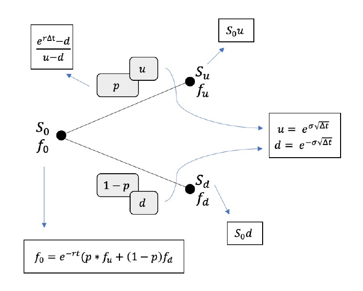

# binomial_option_pricing

App: https://franciscopereira9-binomial-option-pricing-dashboard-4bsg7k.streamlitapp.com/

An implementation of the Binomial Tree model for European and American options.

This repository includes:
- A binomial tree program to approximate the price of the European and American options
- Black-Scholes model to provide a theoretical value for European options
- Hedge (/delta) parameter calculation
- Euler method for hedging simulation

In the paper, the following studies are carried out:
- Theoretical overview of continuous compounding and coupon bonds, no-arbitrage principle, forward contracts, put-call parity, etc...
- Convergence studies of the Binomial Model for increasing number of steps in the tree and comparisson with Black-Scholes
- Response of these models to varying volatility

Future Tasks:
- [ ] Visualise binomial tree in streamlit dashboard
- [ ] Publish streamlit app

